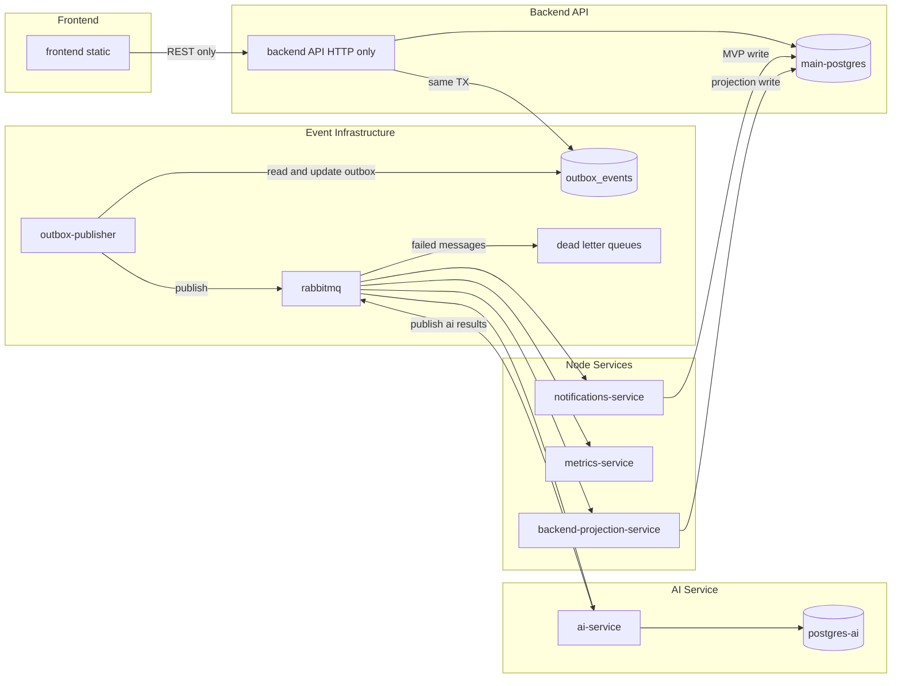

# Target Production Architecture

## Repository layout

```txt
crm-services/
├── frontend/                         # static SPA
├── backend/                          # HTTP API only — no workers, no RabbitMQ consumers
├── contracts/
│   ├── openapi/                      # REST contract
│   └── events/                       # shared event JSON schemas
├── services/
│   ├── notifications-service/        # consumes domain/analytics events, sends emails + in-app notifications
│   ├── metrics-service/              # observes RabbitMQ traffic, exposes /metrics + /health
│   ├── outbox-publisher/             # publishes backend's outbox_events to RabbitMQ
│   ├── backend-projection-service/   # consumes ai.* events, writes safe projections to main DB
│   └── ai-service/                   # Python AI/analytics microservice, owns postgres-ai
├── docker/
│   ├── docker-compose.yml            # core: postgres, redis, backend
│   ├── docker-compose.events.yml     # rabbitmq + outbox-publisher (profile: events)
│   ├── docker-compose.workers.yml    # node worker services (profile: node-workers)
│   └── docker-compose.ai.yml         # postgres-ai + ai-service (profile: python-workers)
└── docs/architecture/                # this folder
```

Every service under `services/` is a standalone deployable unit: its own `package.json`/`pyproject.toml`, its own `Dockerfile`, its own `.env.example`, and its own build/test/lint scripts. None of them import `backend/src/modules/*` — they talk to the rest of the system only through RabbitMQ and their own database connection.

## Runtime topology



## Local Compose modes

```bash
# Core only — no events, no workers
docker compose -f docker/docker-compose.yml up

# + RabbitMQ + outbox-publisher
docker compose -f docker/docker-compose.yml -f docker/docker-compose.events.yml --profile events up

# + Node worker services
docker compose -f docker/docker-compose.yml -f docker/docker-compose.events.yml -f docker/docker-compose.workers.yml \
  --profile events --profile node-workers up

# + Python AI service (own Postgres)
docker compose -f docker/docker-compose.yml -f docker/docker-compose.events.yml -f docker/docker-compose.ai.yml \
  --profile events --profile python-workers up
```

## Production deployment matrix

| Deploy unit | Artifact | Command | Database | RabbitMQ role |
|---|---|---|---|---|
| frontend | `frontend/dist` | static hosting (GitHub Pages, later S3+CloudFront) | none | none |
| backend-api | `backend/Dockerfile` | `node dist/main.js` | main-postgres | none (HTTP only) |
| outbox-publisher | `services/outbox-publisher/Dockerfile` | `node dist/main.js` | outbox_events only | publisher |
| notifications-service | `services/notifications-service/Dockerfile` | `node dist/main.js` | main-postgres (MVP) | consumer |
| metrics-service | `services/metrics-service/Dockerfile` | `node dist/main.js` | none | observer |
| backend-projection-service | `services/backend-projection-service/Dockerfile` | `node dist/main.js` | main-postgres (projections) | consumer |
| ai-service | `services/ai-service/Dockerfile` | `python src/main.py` | postgres-ai | consumer + publisher |
| rabbitmq | managed broker | — | — | infrastructure |
| redis | managed cache | — | — | reserved, unused today |

## Future (post-MVP)

- Split notifications tables into a notifications-service-owned Postgres instance.
- Add `services/future-cpp-service/` for CPU-bound processing (image/file processing, device gateway).
- Add advanced retry/backoff tuning on top of the basic dead-letter queues introduced now.
