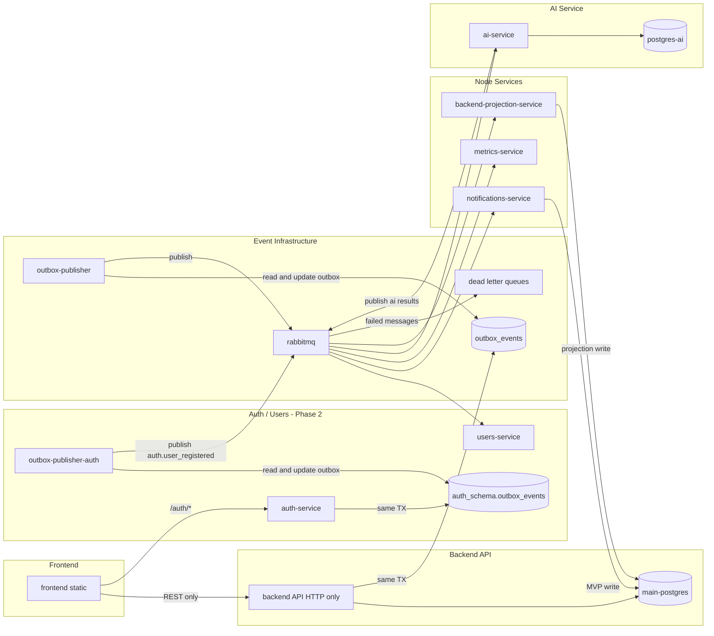

# Target Production Architecture

## Repository layout

```txt
crm-services/
├── frontend/                         # static SPA
├── backend/                          # HTTP API only — no workers, no RabbitMQ consumers
├── contracts/
│   ├── openapi/                      # REST contract
│   └── events/                       # shared event JSON schemas
├── services/
│   ├── auth-service/                 # (Phase 2) identity, sessions, JWT issuance - owns auth_schema
│   ├── users-service/                # (Phase 2) user profiles - owns users_schema, consumer-only until Phase 3
│   ├── notifications-service/        # consumes domain/analytics events, sends emails + in-app notifications
│   ├── metrics-service/              # observes RabbitMQ traffic, exposes /metrics + /health
│   ├── outbox-publisher/             # publishes backend's outbox_events (and, redeployed per Q8, auth-service's) to RabbitMQ
│   ├── backend-projection-service/   # consumes ai.* events, writes safe projections to main DB
│   └── ai-service/                   # Python AI/analytics microservice, owns postgres-ai
├── docker/
│   ├── dev/                          # local development - see docker/dev/README.md
│   │   ├── compose.infra.yml         # postgres, redis, rabbitmq (events), postgres-ai (python-workers)
│   │   ├── compose.services.yml      # app/worker services, containerized (optional - yarn dev is the default)
│   │   ├── compose.gateway.yml       # Traefik only, routes to host.docker.internal
│   │   └── compose.legacy.yml        # Traefik + containerized legacy-backend (container-parity mode)
│   └── prod/                         # interim production shape, before Kubernetes - see docker/prod/README.md
│       └── compose.yml               # every real deploy unit as a container, gateway is the only public port
└── docs/architecture/                # this folder
```

Every service under `services/` is a standalone deployable unit: its own `package.json`/`pyproject.toml`, its own `Dockerfile`, its own `.env.example`, and its own build/test/lint scripts. None of them import `backend/src/modules/*` — they talk to the rest of the system only through RabbitMQ and their own database connection.

## Runtime topology



## Local Compose modes

See `docker/dev/README.md` for the full breakdown. In short:

```bash
# Infra + gateway, app services on the host via `yarn dev` (recommended day-to-day)
docker compose -f docker/dev/compose.infra.yml -f docker/dev/compose.gateway.yml up

# + RabbitMQ + postgres-ai, if you need events/AI running too
docker compose -f docker/dev/compose.infra.yml -f docker/dev/compose.gateway.yml \
  --profile events --profile python-workers up

# Everything containerized instead (container-parity testing)
docker compose -f docker/dev/compose.infra.yml -f docker/dev/compose.legacy.yml \
  -f docker/dev/compose.services.yml --profile events --profile node-workers --profile python-workers up --build
```

## Production deployment matrix

Interim shape (`docker/prod/compose.yml`, see `docker/prod/README.md`) before the
move to Kubernetes/AWS EKS:

| Deploy unit | Artifact | Command | Database | RabbitMQ role |
|---|---|---|---|---|
| gateway | `traefik:v3.0` (no custom image) | — | none | none |
| frontend | `frontend/dist` | static hosting (GitHub Pages, later S3+CloudFront) | none | none |
| backend-api | `backend/Dockerfile` | `node dist/main.js` | main-postgres | none (HTTP only) |
| auth-service | `services/auth-service/Dockerfile` | `node dist/main.js` | auth_schema | none (HTTP + own outbox only) |
| outbox-publisher-auth | `services/outbox-publisher/Dockerfile` (redeployed, Q8) | `node dist/main.js` | auth_schema.outbox_events only | publisher |
| users-service | `services/users-service/Dockerfile` | `node dist/main.js` | users_schema | consumer |
| outbox-publisher | `services/outbox-publisher/Dockerfile` | `node dist/main.js` | outbox_events only | publisher |
| notifications-service | `services/notifications-service/Dockerfile` | `node dist/main.js` | main-postgres (MVP) | consumer |
| metrics-service | `services/metrics-service/Dockerfile` | `node dist/main.js` | none | observer |
| backend-projection-service | `services/backend-projection-service/Dockerfile` | `node dist/main.js` | main-postgres (projections) | consumer |
| ai-service | `services/ai-service/Dockerfile` | `python src/main.py` | postgres-ai | consumer + publisher |
| rabbitmq | managed broker | — | — | infrastructure |
| redis | managed cache | — | — | reserved, unused today |

## Future (post-MVP)

- Split notifications tables into a notifications-service-owned Postgres instance.
- Add `services/future-cpp-service/` for CPU-bound processing (image/file processing, device gateway).
- Add advanced retry/backoff tuning on top of the basic dead-letter queues introduced now.
